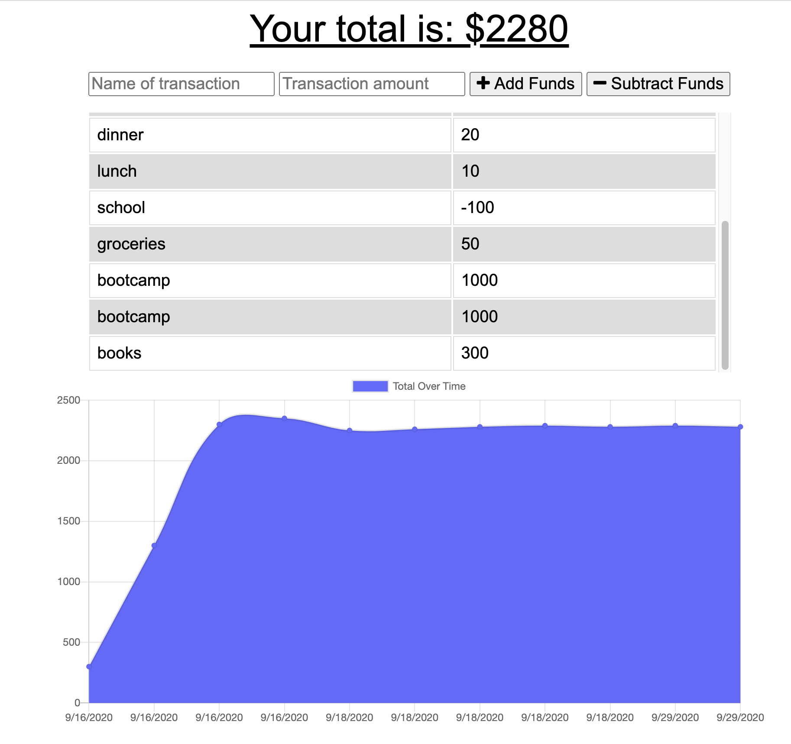

# Budget-Tracker
Created by [BMcCorm](https://github.com/BMcCorm) 

## Table of Contents
- [Description](#Description)
- [Installation](#Installation)
- [Usage](#Usage)
- [Contributing](#Contributors)
- [Testing](#Testing)
- [License](#License)
- [Questions](#Questions)

## Description
This Budget Tracker application allows users to track withdrawls and deposits with or without a data/internet connection. This app uses service-worker and mongoDB.

## Installation
This user-friendly interface does not require installation. It's hosted on Heroku and can be found [here.](https://budget-tracker-bm.herokuapp.com/)

## Usage
The user can add expenses and deposits to their budget with or without a connection. Take the site offline and enter a transaction. The updated budget will also be populated when back online.

## Interested in contributing? Here's how:

1. Fork this repository
2. Create a branch: git checkout -b "create_a_branch_name"
3. Make and commit your changes: git commit -m "add your message here"
4. Push to the master branch: git push origin "branch_name"
5. Create the pull request

Additional information on creating a pull request can be found [here](https://help.github.com/en/github/collaborating-with-issues-and-pull-requests/creating-a-pull-request). 

## Contributors
None at this time.

## Testing
None at this time.

## License
None at this time.

## Questions
For more information, please email me at BrielleMcCormick@gmail.com
The link for this project can be found [here.](https://BMcCorm.github.io/Budget-Tracker/)

